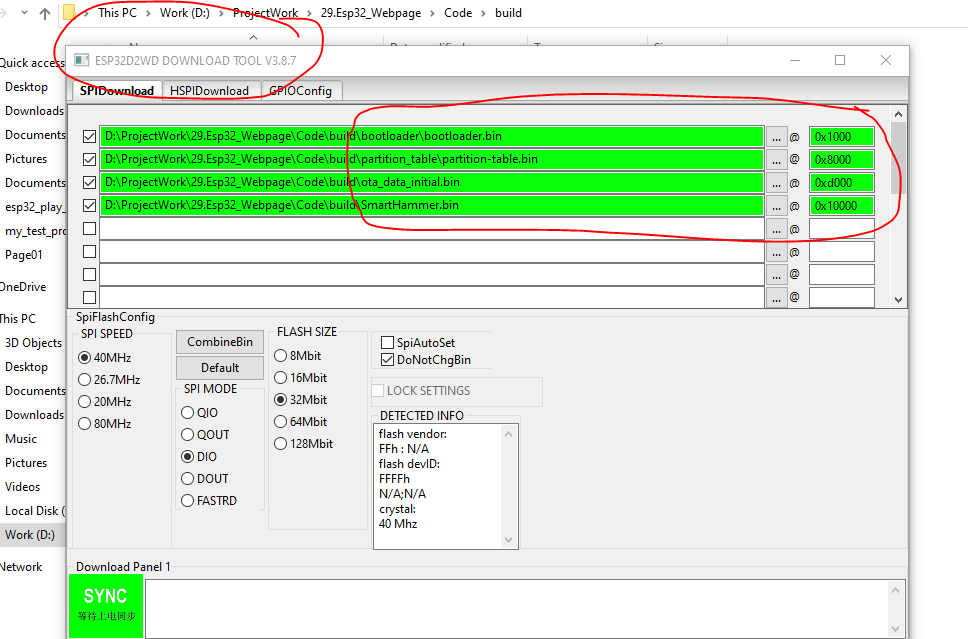
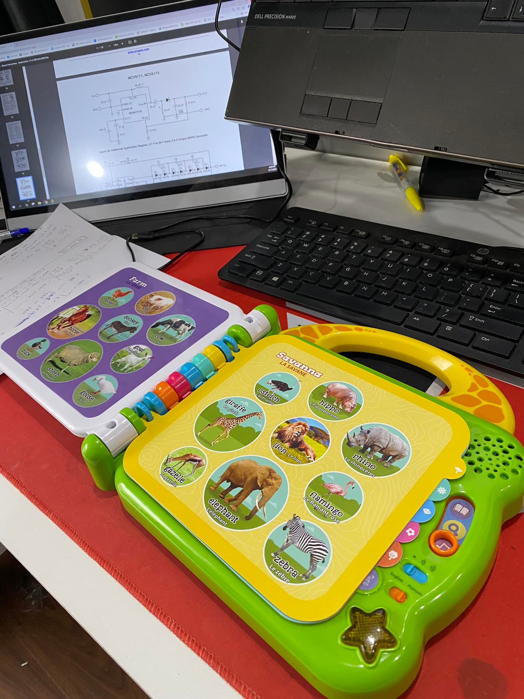

# Smart Toy
This product used for kids.

This project use ESP32 control and play audio via SD card, has touch buttons and mode selection. User can use two language play sound
* build in ESP32-IDF
#How to download the code to the esp32  
user can use "flash_download_tool" for download bin file to the esp32  

#Actual product image
